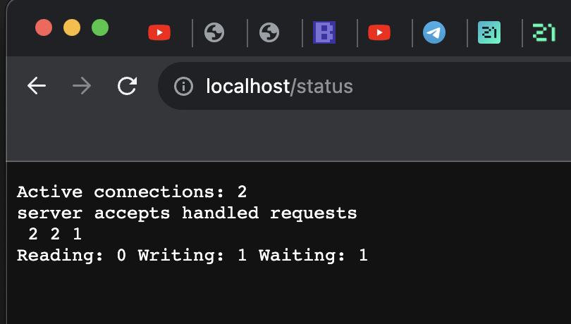

# Docker
---

## Part 1. Готовый докер

#### Взять официальный докер образ с **nginx** и выкачать его при помощи `docker pull`

- Устанавливаю docker `sudo apt install docker.io`
- Скачиваю образ nginx `sudo docker pull ngingx` 

#### Проверить наличие докер образа через `docker images`

- Проверяю, что образ скачался при помощи `docker images` 

#### Запустить докер образ через docker `run -d [image_id | repository]`

> run -d означает запуск контейнера в фоновом режиме

- Запускаю контейнер через `run -d [image_id | repository]` 

#### Проверить что образ запустился через `docker ps`

- Проверяю что докер запустился через `docker ps` 

#### Посмотреть информацию о контейнере через `docker inspect [container_id|container_name]`

- Просматриваю информацию о контейнере через `sudo docker inspect cb4573302ee49` 

#### По выводу команды определить и поместить в отчёт размер контейнера, список замапленных портов и ip контейнера

- Размер контейнера 

- Cписок запампленных портов 

- Размер 

#### Остановить докер образ через `docker stop [container_id|container_name]`

- Останавливаю докер через `sudo docker stop cb4573302ee4` 

#### Проверить, что образ остановился через `docker ps`

- Проверяю через `sudo docker ps` 

#### Запустить докер с портами 80 и 443 в контейнере, замапленными на такие же порты на локальной машине, через команду run

- Запускаю контейнер с портами 80 и 443 `sudo docker run -d -p 80:80 -p 443:443 nginx` 

### Проверить, что в браузере по адресу *localhost:80* доступна стартовая страница **nginx**

- Проверяю, что стартовая страница nginx доступна 

### Перезапустить докер контейнер через `docker restart [container_id|container_name]`
### Проверить любым способом, что контейнер запустился

- Перезапускаю контейнер и проверяю что перезапустился 

## Part 2. Операции с контейнером

### Прочитать конфигурационный файл *nginx.conf* внутри докер контейнера через команду *exec*

- Командой `sudo docker exec 12f5426f0b53 cat /etc/nginx/nginx.conf` просматриваю файл конфигурации. 

### Создать на локальной машине файл *nginx.conf*
### Настроить в нем по пути */status* отдачу страницы статуса сервера **nginx**

- Создаю файл nginx.conf, за основу взят имеющийся файл и добавляю отдачу статуса сервера nginx 

### Скопировать созданный файл *nginx.conf* внутрь докер образа через команду `docker cp`
### Перезапустить **nginx** внутри докер образа через команду *exec*

- Копирую внутрь контейнера с помощью `docker cp`

- Перезапускаю контейнер с помощью `sudo docker exec exciting_williamson nginx -s reload`

### Проверить, что по адресу *localhost:80/status* отдается страничка со статусом сервера **nginx**

### Экспортировать контейнер в файл *container.tar* через команду *export*
### Остановить контейнер
### Удалить образ через `docker rmi [image_id|repository]`, не удаляя перед этим контейнеры

- Экспортирую контейнер `sudo docker export exciting_williamson > container.tar`, останавливаю контейнер `sudo docker stop 12f5426f0b53` и удаляю образ nginx `sudo docker rmi nginx -f` 

### Удалить остановленный контейнер
### Импортировать контейнер обратно через команду *import*
### Запустить импортированный контейнер

### Проверить, что по адресу *localhost:80/status* отдается страничка со статусом сервера **nginx**

## Part 3. Мини веб-сервер

#### Написать мини сервер на **C** и **FastCgi**, который будет возвращать простейшую страничку с надписью `Hello World!`

- Создаю файл server.c который будет возвращать надпись `Hello World!` 

### Написать свой *nginx.conf*, который будет проксировать все запросы с 81 порта на *127.0.0.1:8080*

- Задаю конфигурацию файла nginx.conf 

### Запустить написанный мини сервер через *spawn-fcgi* на порту 8080

- Для запуска моего сервера делаю следующие шаги: 
- - Запускаю контейнер **nginx** c 81 портом

- - копирую в контейнер **server.c** и **nginix.conf** 

- - Захожу в контейнер и проверяю что файлы перенесены 

- - Обновляю и устанавливаю **gcc**, **spawn-fcgi** и **libfcgi-dev** 

- - Компилирую `gcc server.c -lfcgi` и запускаю сервер `spawn-fcgi -p 8080 ./a.out`, перезагружаю контейнер  

### Проверить, что в браузере по *localhost:81* отдается написанная вами страничка

- - Проверяю что всё работает

# localhost:81 не работает на маке, завтра проверить добавить проброс портов 81:81 и проверить еще раз

## Part 4. Свой докер

#### Написать свой докер образ, который:
##### 1) собирает исходники мини сервера на FastCgi из [Части 3](#part-3-мини-веб-сервер)
##### 2) запускает его на 8080 порту
##### 3) копирует внутрь образа написанный *./nginx/nginx.conf*
##### 4) запускает **nginx**.

- Создаю свой Dockerfile 

##### Собрать написанный докер образ через `docker build` при этом указав имя и тег

- Собираю свой докер 

##### Проверить через `docker images`, что все собралось корректно

- Проверяю что сборка успешна 

##### Запустить собранный докер образ с маппингом 81 порта на 80 на локальной машине и маппингом папки *./nginx* внутрь контейнера по адресу, где лежат конфигурационные файлы **nginx**'а (см. [Часть 2](#part-2-операции-с-контейнером))

- Запускаю 

##### Проверить, что по localhost:80 доступна страничка написанного мини сервера

- Смотрю что по localhost доступна страничка с сервером 

##### Дописать в *./nginx/nginx.conf* проксирование странички */status*, по которой надо отдавать статус сервера **nginx**

- Дописываю конфиг по которому будет отображаться статус 

##### Перезапустить докер образ

##### Проверить, что теперь по *localhost:80/status* отдается страничка со статусом **nginx**

-  Проверяю что по localhost:80/status отображается страничка со статусом 

## Part 5. **Dockle**

### Скачиваем dockle:
- `wget https://github.com/goodwithtech/dockle/releases/download/v0.4.13/dockle_0.4.13_Linux-64bit.deb`
    

- `sudo dpkg -i dockle_0.4.13_Linux-64bit.deb`
    

### Просканировать образ из предыдущего задания через dockle [image_id|repository]

- Запускаю dockle `sudo dockle my_nginx:my_latest`

### Исправить образ так, чтобы при проверке через dockle не было ошибок и предупреждений

- Дополняю свой docker исправляя ошибки Fatal и Warning 

- Снова запускаю dockle, остались только INFO

## Part 6. Базовый **Docker Compose**

##### Написать файл *docker-compose.yml*, с помощью которого:
##### 1) Поднять докер контейнер из [Части 5](#part-5-инструмент-dockle) _(он должен работать в локальной сети, т.е. не нужно использовать инструкцию **EXPOSE** и мапить порты на локальную машину)_
##### 2) Поднять докер контейнер с **nginx**, который будет проксировать все запросы с 8080 порта на 81 порт первого контейнера

- Создаю файл **docker-composee.yml** 

"ЗАПУСКАЕТСЯ БИЛД ИЗ 05"

##### Замапить 8080 порт второго контейнера на 80 порт локальной машины

- Меняю файл конфигурации 

##### Остановить все запущенные контейнеры

- Смотрю что запущенных контейнеров нет 

##### Собрать и запустить проект с помощью команд `docker-compose build` и `docker-compose up`

- Командой `docker-compose build` собираются образы и командой `docker-compose up` запускаются контейнеры 

- Проверить, что в браузере по localhost:80 отдается написанная вами страничка, как и ранее

